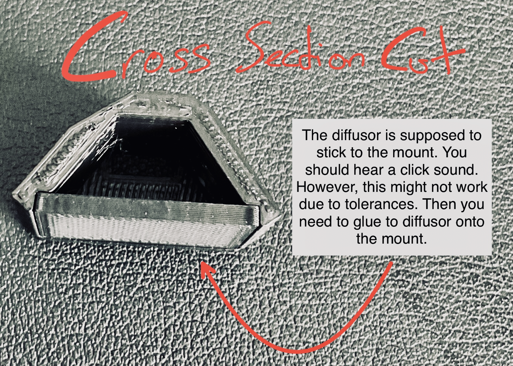

# Ender 5 S1 Lighting Mod (v1)

This is a lighting mod for the Ender 5 S1. It is designed to fit the body enclosure and top cover (can be used without as well) and to be used with 20x20 mm aluminum profiles, but can be adapted to other profiles.

    
    

## Requirements

- Genric, easy to print and inexpensive.
- Tiny & good looking (meaning: mostly unvisible).
- Working with the offical enclosures (body & top cover).

## Bill of Materials (BoM) 🛍️

1. LED strip (max. 8mm wide).
2. Power adapter for the LED strip OR a dc-dc converter with a constant voltage, if you want to connect the LEDs directly to your printer's power supply.
3. Filament for the mounts (e.g. black PLA/PETG). Filament for the diffusors (e.g. transparent PETG).
4. M4x8 screws and M4 "hammerhead" T-nuts.

(Tools are not mentioned.)

## Build Instructions 🏗️

---

### Printing the Parts 🖨️

1. Print the mounts and – optionally – the diffusors. If your printer offers enough print bed size, you can choose to print them (both mount and diffusor ~280mm in total) in one piece. Otherwise print the cutted version (`Top…` and `Bottom…`). PLA gave me satisfying results here: print the mounts horizontally, keep the end on the ground and you won't need any supports. Transparent PETG for the diffusors turned out well. (Note that you need 4x [adapters](./3mf/EnclosureAdapter.3mf) if you want to use the lighting system with the Ender 5 S1's body enclosure. You can also use the adapters for other purposes.)

    
    

---

### Assembly, Wiring & Crimping 🛠️

2. Glue the LED onto the mount and wire them together. I highly encourage you to use some sort of connectors (e.g. JST connectors) instead of soldering multiple wires together (crimping will prevent later suffering!).

    

3. Pull two wires through the aluminium profiles and the main wiring harness into the mainboard's box. I used black to cover the wires and hold them in place.

    

4. Install the mounts with the M4x8 screws and T-nuts.

    
    
    
    

---

### Final Installation 🔌💡

6. Connect a separate power supply or use a dc-dc converter. My printer's power supply outputs 24V. I connected a dc-dc converter to the main power adapter of the printer, it then outputs constant 12V.

    
    
    

7. If you chose to use diffusors, stick them into the mount. They are designed to fit just right into them and you should hear a "click" sound. However, due to tolerances, this might not be the case and you will have to glue them.

    

