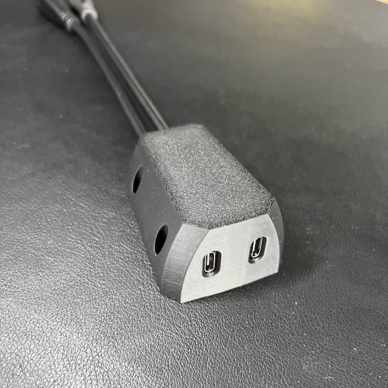

# USB-C Under-Desk Mount

A 3d printed USB-C under-desk mount for various USB-C devices, such as YubiKeys, charging cables, USB-C sticks, etc.

> [!NOTE]
> This is v2 and was originally designed for the YubiKey 5C NFC (v1 can be found [here](../YubiKey-under-desk-mount/README.md)).
> The first version had issues with the USB-C port cutout and was too deeply inset for any other USB-C device, including other YubiKeys.
> With the second version, the issue has been resolved, and the mount can be used with any USB-C device.
> It is fully backwards compatible with the first version, so you can use the same USB-C extension cables
> and don't need to drill new holes in your desk.

    
    
    

    
    
    

## Parts

1. **Mount**: The main part that is attached to the underside of your desk.
2. **Clamp**: A tiny clamp used inside the mount for securing the USB-C extension cables (this is new in v2).

## Printing Instructions, BOM & Assembly

- **Filament**: whatever you prefer (I used standard PLA)
- **Printing time**: On an average printer, this takes less than 1 hour (~45min in my case)
- **Supports**: none, print as is (I only used a small tree support for the clamp, which goes inside the mount)
- **Cables**: 2x "USB C extender Female to Male with screw mount" are screwed into the mount. My cable came with USB 3.1 gen 2 (10 Gbit/s). I orderd them as a pack from amazon: https://www.amazon.de/dp/B0D8SGMGT3. These are only 20 cm in length, so you will need extender cables to your machine.
- **Screws**:
    - **4x M3x16** countersunk / flat head wood screws to attach the mount to the underside of your desk. The outer diameter of the screw head is 5.5 mm. The mount is designed to fit countersunk screws with exactly this diameter or less. Obviously, you can use any screw length you like, as long as it's countersunk, the screw head diameter is ≤ 5.5 mm and it should be M3.
    - *all of the same type:* cylinder screw head with internal hex
        - **2x M2.5x20** – one for each bottom-facing thread of the USB-C extension cables to secure them in the mount
        - **2x M2.5x16** – one for each top-facing thread of the USB-C extension cables to secure them in the mount through the clamp
        - **1x M2.5x8** – to secure the clamp to the mount
- **Miscellaneous**:
    - A long allen key (the assembly is a bit tricky…)

**Assembly**:
1. Print the mount and the clamp.
1. On the inside at the base of the mount is a horizontal beam with two holes for the **M2.5x20** screws. Pre-screw these (don't worry if they are not straight, the holes are intentionally slightly angled).
1. Insert both USB-C extension cables into the cutouts in the mount and screw them in place with the previously pre-screwed **M2.5x20** screws. You will need an allen key. If everything is aligned correctly, the 20mm screws should be perfectly flush with the beam.
1. Pre-screw the clamp with the **M2.5x8** screw. Then insert the clamp into the mount between the two USB-C extension cables. Eventually tighten the clamp with the pre-screwed **M2.5x8** into the mount.
1. Lastly, screw the top-facing threads of the USB-C extension cables with the **M2.5x16** screws through the clamp into the mount.

The mount can now be attached to the underside of your desk with the **M3x16** screws.
