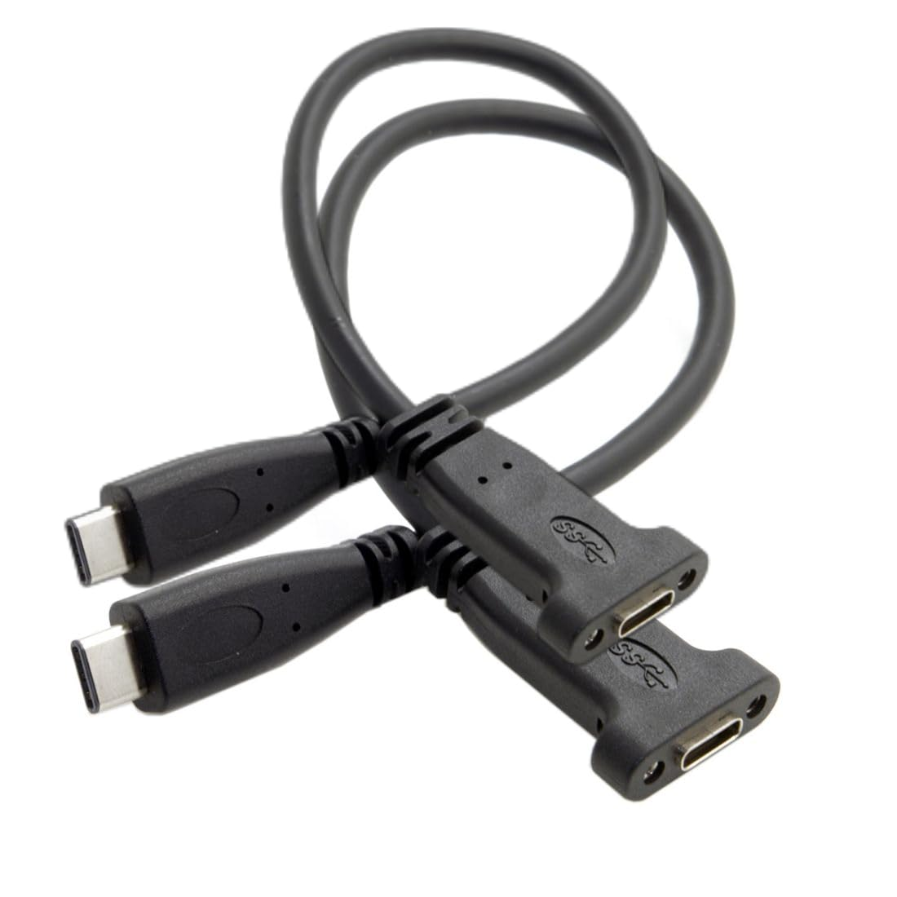

# Double USB Type-C Under-Desk Mount for YubiKey 5C NFC

I have multiple machines and a few YubiKeys around. After a while of manually reaching the backend of each machine, inserting YubiKeys and pulling them out, I became tired.
I was looking for a solution where I can 1) quickly insert the keys, 2) to all machines at the same time, and 3) not needing to reach the back of my PC.
There are some vertical USB Type-C stands, but they are rather ugly and if possible, I prefer the YubiKeys to not be visible.

This is a quickly printed mount that can be attached to the underside of your desk (and of course, the upper side too).
It uses very short USB-C extensions cables (female to male) with screw holes. I ordered them from amazon and they are originally intended to be screwd into PCI cover plates.

    
    
    

    
    
    

## Printing Instructions & BOM

- **Filament**: whatever you prefer (I used standard PLA)
- **Supports**: none, print as is
- **Cables**:
    - 2x "USB C extender Female to Male with screw mount" are screwed into the mount
        - My cable came with USB 3.1 gen 2 (10 Gbit/s)   
        - I orderd them as a pack from amazon: https://www.amazon.de/dp/B0D8SGMGT3
        - These are only 20 cm in length, so you will need extender cables to your machine
- **Screws**:
    - 4x M3x16 countersunk / flat head wood screws to attach the mount to the underside of your desk
        - The outer diameter of the screw head is 5.5 mm. The mount is designed to fit countersunk screws with exactly this diameter or less.
        - Obviously, you can use any screw length you like, as long as it's countersunk, the screw head diameter is ≤ 5.5 mm and it should be M3.
    - 4x M2.5x12 cylinder screw head with internal hex
        - If you are using the same "USB C extender Female to Male with screw mount" cables, it must be M2.5 with ± 12 mm
 
> [!WARNING]
> The USB port cutout will have a _very tight_ fit with the M2.5x12 cylinder heads screwed in. I.e., no tolerance at all.
> My YubiKey 5C NFC fits perfectly. However, it leaves minimal [abrasion marks at the tip of the YubiKey](./assets/abrasive_marks.png) because the fit is so narrow.
> Be aware that, if your M2.5x12 cylinder screw head is larger than ~4.3 mm, it probably won't fit.
